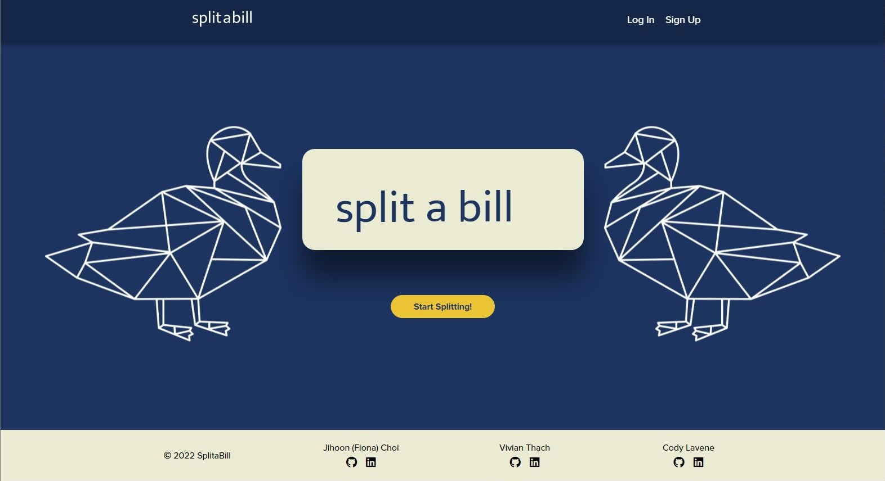
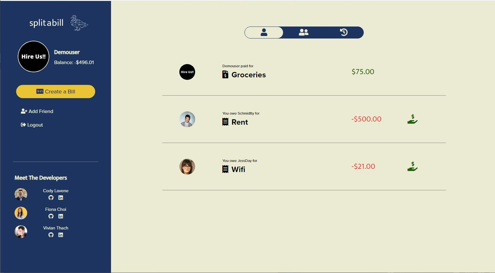
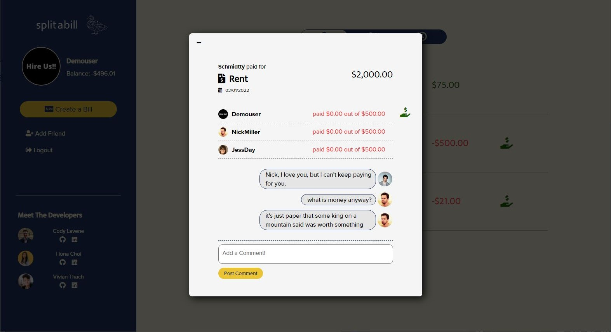
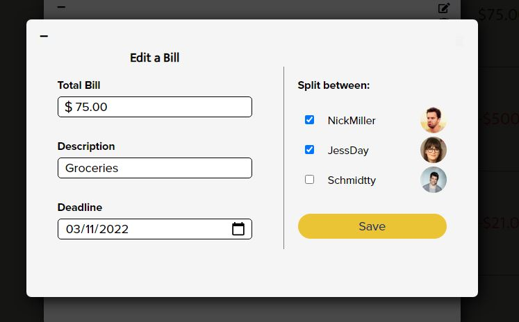
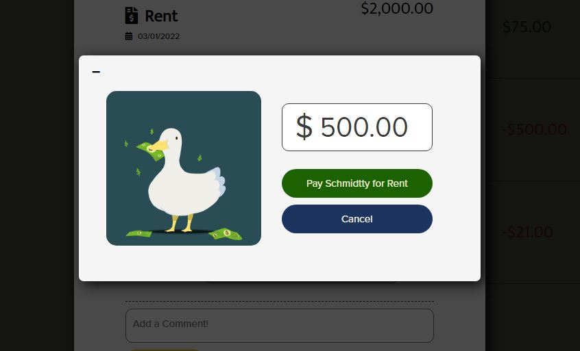
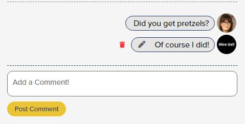
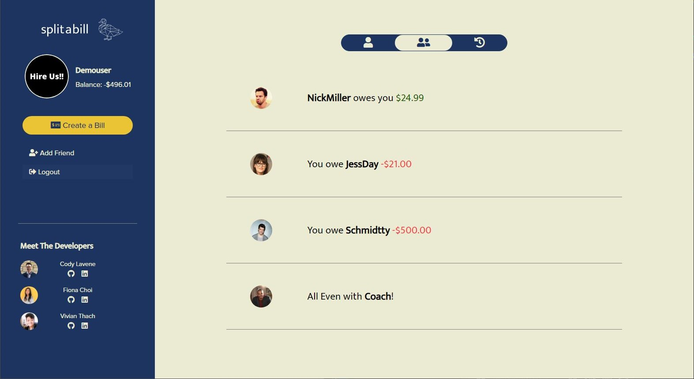
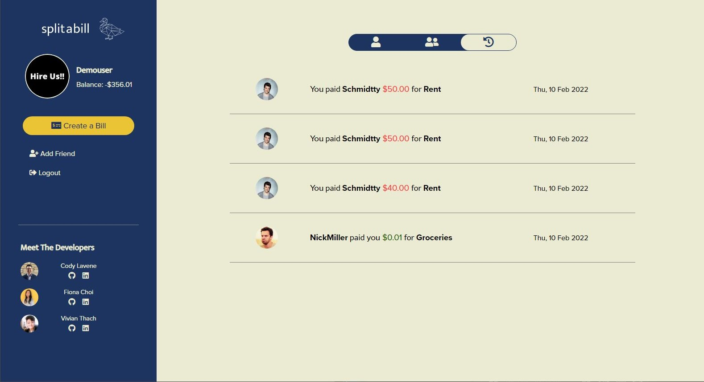
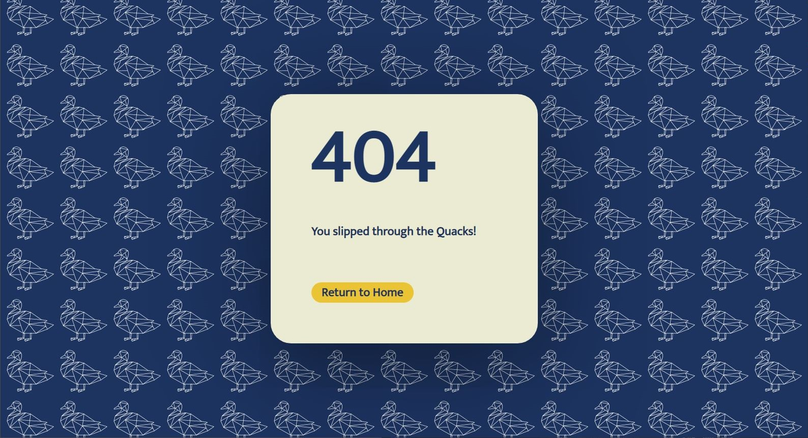
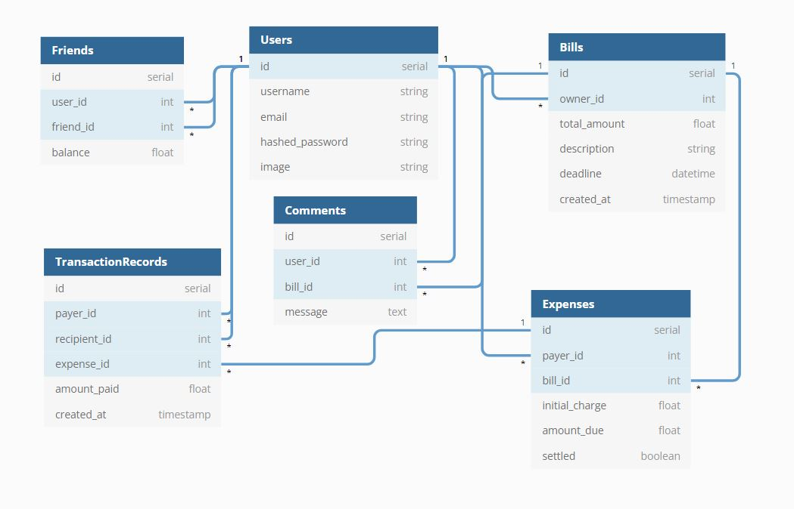

# SplitaBill

SplitaBill, inspired by the functionality of [Splitwise](https://www.splitwise.com) and the clean design of [Venmo](https://www.venmo.com), is an app where users can keep track of and pay bills/expenses shared between friends.

- [Live Site](https://split-a-bill.herokuapp.com)
- [MVP Feature List](https://github.com/choi-jihoon/SplittaBill/wiki/MVP-Features-List)
- [Database Schema](https://github.com/choi-jihoon/SplittaBill/wiki/Database-Schema)
- [Frontend Routes](https://github.com/choi-jihoon/SplittaBill/wiki/Frontend-Routes)
- [API Documentation](https://github.com/choi-jihoon/SplittaBill/wiki/API-Documentation)
- [User Stories](https://github.com/choi-jihoon/SplittaBill/wiki/User-Stories)

# Technologies Used


# Getting started

1. Clone this repository

   ```git@github.com:choi-jihoon/SplittaBill.git```

2. CD into the /app directory and install dependencies

    ```pipenv install```

3. CD into the /react-app directory and install dependencies

    ```npm install```

4.  Create a .env file based on the .env.example given (An AWS S3 account is required for adding/editing user profile pictures!)

5.  Create a user in psql based on your .env DATABASE_URL app_name

    ```psql -c "CREATE USER <username> PASSWORD '<password>' CREATEDB"```

6.  Create a databse in psql based on your.env DATABASE_URL app_db_name

7. Start your shell, migrate your database, seed your database, and run the flask app

   ```pipenv shell```

   ```flask db upgrade```

    ```flask seed all```

    ```flask run```

8. Open another terminal and change directory into /react-app and run the React app

	```npm start```


# Features

## Splash Page & User Authentication

Users can log into an existing account or sign up and create a new account. Alternatively, users can test the site with the Demo Login feature.




## User Dashboard

The logged in user's dashboard displays all the bills and expenses related to the user, as well as a side panel where the user can edit their profile picture, create a bill, add a friend, or log out.




## Bills & Expenses Tab

Clicking on a specific bill or expense will display a modal with the details for that bill or expense (people involved, how much each person still needs to pay for their individual expense, and comments made on the bill).



The user has the option to edit/delete bills they own, and pay back their expenses.






## Comments

The user can add comments on the bill detail modal, and edit/delete comments that they own.




## Friends Tab

Navigating to the friends tab will display a list of the user's friends and current balances. Clicking on a friend will display transaction records between the user and the friend.

The user can delete friends as long as all expenses between the user and the friend has been settled (balance is zero).




## Transaction History Tab

Navigating to the transaction history tab will display all the transactions the user has been involved in, with the most recent on top.




## Page Not Found

Trying to access a path that does not exist will render a 404 Page component.



# Database Schema

